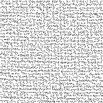

Introduction

Ref: https

://

www.siemens.co.uk

/pool/

news_press

/education/images/

bat.jpg

Introduction

Sound:

Mechanical wave



Air pressure pulses (

frequency

).

Constant

speed

in the same medium at constant temperature.

Distance!

Propagation

time

.

Objective

Calculate the coordinates of an ultrasound* transmitter using 3 ultrasound sensors.

*Ultrasound: sound with frequency &gt; 20kHz.

Ref: http://

www.mikroe.com

/

easypic

-fusion/

Ref: https

://

www.aimagin.com

/

Frequency:

Sensor = 40kHz

Bat = 10-120kHz

Ref: http:/

/

img.informer.com

/

Methods

Simulation

.

Transmitter

controlled by the

board.

Independent

transmitter connected to the

board.

Physical system.

Transmitter controlled by the board.

Independent

transmitter connected to the board

.

Transmitter not connected to the board

.

a

a

a

Procedure

Location of the transmitter

Setup

•

: receivers

•

: detected position

•

: real position

Discussion and conclusion

Good (

~

5,33 cm) precision of detection.

Sensor’s angle limitation (45º).

Memory limitation.

Problematic wire connections.

Thank you!

